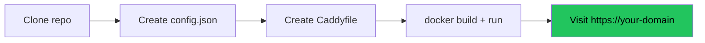
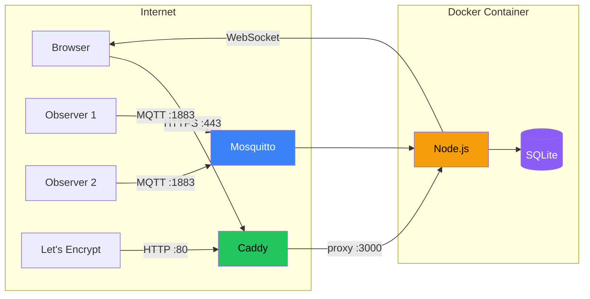
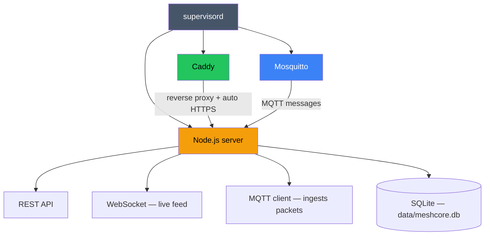
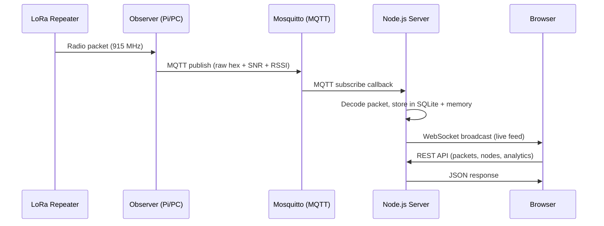

# Deploying MeshCore Analyzer

Get MeshCore Analyzer running with automatic HTTPS on your own server.

## Table of Contents

- [What You'll End Up With](#what-youll-end-up-with)
- [What You Need Before Starting](#what-you-need-before-starting)
- [Installing Docker](#installing-docker)
- [Quick Start (5 minutes)](#quick-start-5-minutes)
- [Connecting an Observer](#connecting-an-observer)
- [Updating](#updating)
- [Common Gotchas](#common-gotchas)
  - [Port 80 must be open for HTTPS](#️-port-80-must-be-open-for-https-to-work)
  - [MQTT port 1883 security](#️-mqtt-port-1883--do-not-expose-to-the-internet-unprotected)
  - [Database backups](#️-database-backups)
  - [DNS before container](#️-domain-dns-must-be-configured-before-starting-the-container)
  - [Config is read-only](#️-config-file-is-read-only-in-docker)
- [Customization](#customization)
- [Troubleshooting](#troubleshooting)
- [Architecture Overview](#architecture-overview)

## What You'll End Up With

- MeshCore Analyzer running at `https://your-domain.com`
- Automatic HTTPS certificates (via Let's Encrypt + Caddy)
- Built-in MQTT broker for receiving packets from observers
- SQLite database for packet storage (auto-created)
- Everything in a single Docker container

## What You Need Before Starting

### A server
A computer that's always on and connected to the internet. Options:
- **Cloud VM** (easiest) — DigitalOcean, Linode, Vultr, AWS, Azure, etc. A $5-6/month VPS works fine. Pick **Ubuntu 22.04 or 24.04** when creating it.
- **Raspberry Pi** — Works great, just slower to build.
- **Old PC/laptop at home** — Works if your ISP doesn't block ports 80/443 (many do).

You'll need **SSH access** to your server. If you're using a cloud provider, they'll give you instructions when you create the VM.

### A domain name
A domain (like `analyzer.example.com`) pointed at your server. You can:
- Buy one (~$10/year) from Namecheap, Cloudflare, Google Domains, etc.
- Or use a free subdomain from [DuckDNS](https://www.duckdns.org/) or [FreeDNS](https://freedns.afraid.org/)

After getting a domain, create an **A record** pointing to your server's IP address. Your domain provider's dashboard will have a "DNS" section for this.

### Open ports
Your server's firewall must allow traffic on:
- **Port 80** — needed for automatic HTTPS certificate provisioning
- **Port 443** — the actual HTTPS traffic

If you're on a cloud provider, find "Security Groups" or "Firewall" in the dashboard and add rules to allow TCP ports 80 and 443 from anywhere (0.0.0.0/0).

## Installing Docker

Docker packages your app and all its dependencies into a "container" — think of it as a lightweight, isolated mini-computer running inside your server. You don't need to install Node.js, Mosquitto, or Caddy separately — Docker handles all of it.

**SSH into your server** and run these commands:

```bash
# Download and run Docker's official install script
curl -fsSL https://get.docker.com | sh

# Let your user run Docker without sudo (log out and back in after this)
sudo usermod -aG docker $USER
```

Log out and SSH back in, then verify:

```bash
docker --version
# Should print something like: Docker version 24.x.x
```

That's it. Docker is installed.

## Quick Start (5 minutes)



### Step 1: Download the code

```bash
# Clone the repository (downloads all the source code)
git clone https://github.com/Kpa-clawbot/meshcore-analyzer.git

# Go into the folder
cd meshcore-analyzer
```

### Step 2: Create your config file

```bash
# Copy the example config to create your own
cp config.example.json config.json
```

Open `config.json` in a text editor (`nano config.json` is the easiest):

```jsonc
{
  "port": 3000,                          // Leave this alone
  "apiKey": "pick-a-random-secret",      // Make up a secret phrase — protects write endpoints
```

The config has many options but the defaults work out of the box. You can customize later. The one thing to update now is the `apiKey` — change it from the example to any random string.

Save and close the file (`Ctrl+O`, `Enter`, `Ctrl+X` in nano).

### Step 3: Set up HTTPS for your domain

```bash
# Create a folder for the Caddy config
mkdir -p caddy-config
```

Create the Caddyfile (this tells Caddy your domain name):

```bash
nano caddy-config/Caddyfile
```

Type exactly this (replacing with your actual domain):

```
analyzer.example.com {
    reverse_proxy localhost:3000
}
```

Save and close. **That's your entire HTTPS configuration.** Caddy will automatically get certificates from Let's Encrypt, handle renewals, and redirect HTTP to HTTPS.

### Step 4: Build and run

```bash
# Build the Docker image (takes 1-2 minutes the first time)
docker build -t meshcore-analyzer .

# Run it
docker run -d \
  --name meshcore-analyzer \
  --restart unless-stopped \
  -p 80:80 \
  -p 443:443 \
  -v $(pwd)/config.json:/app/config.json:ro \
  -v $(pwd)/caddy-config/Caddyfile:/etc/caddy/Caddyfile:ro \
  -v meshcore-data:/app/data \
  -v caddy-data:/data/caddy \
  meshcore-analyzer
```

**What each line does:**
- `docker run -d` — run in the background
- `--name meshcore-analyzer` — give it a name so you can refer to it later
- `--restart unless-stopped` — auto-restart if it crashes or the server reboots
- `-p 80:80 -p 443:443` — expose the web ports
- `-v .../config.json:/app/config.json:ro` — mount your config (read-only)
- `-v .../Caddyfile:...` — mount your domain config
- `-v meshcore-data:/app/data` — persistent storage for the database
- `-v caddy-data:/data/caddy` — persistent storage for HTTPS certificates

### Step 5: Verify

Open `https://your-domain.com` in a browser. You should see the MeshCore Analyzer home page. It'll be empty until you connect an observer.

Check the logs:

```bash
docker logs meshcore-analyzer
```

You should see:
```
MeshCore Analyzer running on http://localhost:3000
MQTT [local] connected to mqtt://localhost:1883
[pre-warm] 12 endpoints in XXXms
```

## Connecting an Observer

The analyzer receives packets from MeshCore observers via MQTT. You have two options:

### Option A: Use a public broker (easiest)

Add a public MQTT broker to your `config.json` under `mqttSources`:

```json
{
  "name": "public-broker",
  "broker": "mqtts://mqtt.lincomatic.com:8883",
  "username": "your-username",
  "password": "your-password",
  "rejectUnauthorized": false,
  "topics": ["meshcore/SJC/#", "meshcore/SFO/#"]
}
```

You'll need credentials from the broker operator. Restart the container after editing config.

### Option B: Run your own observer (more data, your area)

You need:
1. A MeshCore repeater connected via USB or BLE to a computer
2. [meshcoretomqtt](https://github.com/Cisien/meshcoretomqtt) or a custom BLE observer script
3. Point it at your analyzer's MQTT broker

If your analyzer is at `analyzer.example.com`, configure the observer to publish to `mqtt://analyzer.example.com:1883`.

⚠️ **Read the MQTT Security section below before opening port 1883.**

## Updating

```bash
cd meshcore-analyzer
git pull
docker build -t meshcore-analyzer .
docker restart meshcore-analyzer
```

Your data is preserved in Docker volumes (`meshcore-data` and `caddy-data`).

---

## Common Gotchas

### ⚠️ Port 80 MUST be open for HTTPS to work

Caddy uses the **ACME HTTP-01 challenge** to get certificates from Let's Encrypt. This requires port 80 to be reachable from the internet. If port 80 is blocked by your firewall or cloud provider, HTTPS provisioning will fail silently and your site won't load.

**Check:** `curl http://your-server-ip` from another machine should connect (even if it shows an error page — that's fine).

**Common blockers:**
- Cloud provider security groups (AWS, Azure, GCP) — add inbound rule for port 80 + 443
- UFW firewall — `sudo ufw allow 80/tcp && sudo ufw allow 443/tcp`
- ISP blocking port 80 on residential connections — use a Cloudflare tunnel instead

### ⚠️ MQTT Port 1883 — DO NOT expose to the internet unprotected

The built-in MQTT broker (Mosquitto) runs on port 1883 with **anonymous access enabled by default**. This is fine for local use, but if you expose it to the internet, anyone can:
- Publish fake packets to your analyzer
- Subscribe and snoop on all mesh traffic

**Options (pick one):**

1. **Don't expose 1883 at all** (safest) — Remove `-p 1883:1883` from the docker run command. Only processes inside the container can use MQTT. Your remote observers connect to a separate public broker instead.

2. **Firewall it** — Only allow specific IPs (your observer machines):
   ```bash
   # UFW example
   sudo ufw allow from 192.168.1.0/24 to any port 1883
   ```

3. **Add authentication** — Edit `docker/mosquitto.conf`:
   ```
   allow_anonymous false
   password_file /etc/mosquitto/passwd
   ```
   Then create users: `docker exec meshcore-analyzer mosquitto_passwd -c /etc/mosquitto/passwd myuser`

### ⚠️ Database backups

Your packet data lives in `meshcore.db` inside the `meshcore-data` Docker volume. If the volume is deleted, all data is gone.

**Find your database file:**

```bash
# Show where Docker stores the volume on disk
docker volume inspect meshcore-data --format '{{ .Mountpoint }}'
# e.g., /var/lib/docker/volumes/meshcore-data/_data/meshcore.db
```

**Back it up:**

```bash
# Copy the DB to a backup location
cp $(docker volume inspect meshcore-data --format '{{ .Mountpoint }}')/meshcore.db ~/meshcore-backup-$(date +%Y%m%d).db
```

**Automate with cron (recommended):**

```bash
# Add to crontab: daily backup at 3am
0 3 * * * cp $(docker volume inspect meshcore-data --format '\{\{ .Mountpoint \}\}')/meshcore.db /home/youruser/backups/meshcore-$(date +\%Y\%m\%d).db
```

**Tip:** If you'd rather mount a local directory instead of a Docker volume (easier to find and back up), replace `-v meshcore-data:/app/data` with `-v ./analyzer-data:/app/data` in the docker run command.

### ⚠️ Domain DNS must be configured BEFORE starting the container

Caddy tries to provision HTTPS certificates on startup. If your domain doesn't point to the server yet, it will fail. The order is:
1. Create DNS A record: `analyzer.example.com → your-server-ip`
2. Wait for DNS propagation (usually 1-5 minutes, sometimes up to an hour)
3. Verify: `dig analyzer.example.com` should show your IP
4. THEN start the container

### ⚠️ Config file is read-only in Docker

The `config.json` is mounted read-only (`:ro`). To change config:
1. Edit the file on the host
2. Restart: `docker restart meshcore-analyzer`

Don't try to edit it from inside the container.

### ⚠️ Don't use the internal HTTPS option

`config.json` has an `https` section with cert/key paths. **Ignore it.** Caddy handles HTTPS for you automatically. The internal HTTPS option is for running without Docker/Caddy, which is more work and harder to maintain.

---

## Customization

### Changing the look

Create a `theme.json` in your data directory:

```bash
# Find your volume location
docker volume inspect meshcore-data | grep Mountpoint

# Or just mount a local directory instead:
# -v ./my-data:/app/data
```

See [CUSTOMIZATION.md](./CUSTOMIZATION.md) for all theme options.

### Adding your branding

In `config.json`:

```json
{
  "branding": {
    "siteName": "Bay Area Mesh",
    "tagline": "Community LoRa network for the Bay Area",
    "logoUrl": "https://example.com/logo.png",
    "faviconUrl": "https://example.com/favicon.ico"
  }
}
```

---

## Troubleshooting

| Problem | Solution |
|---------|----------|
| Site shows "connection refused" | Check `docker ps` — is the container running? Check `docker logs meshcore-analyzer` for errors |
| HTTPS not working, shows HTTP | Port 80 is blocked — Caddy can't complete the ACME challenge. Open port 80. |
| "too many certificates" error | You hit Let's Encrypt rate limits (5 certs per domain per week). Wait a week, or use a different subdomain. |
| No packets appearing | Check MQTT: `docker exec meshcore-analyzer mosquitto_sub -t 'meshcore/#' -C 1 -W 10` — if nothing in 10 seconds, no observer is publishing. |
| Container crashes on startup | Usually bad `config.json` — check JSON syntax: `python3 -c "import json; json.load(open('config.json'))"` |
| Database corruption after crash | Restore from backup. SQLite WAL mode handles most crash recovery automatically, but hard kills can corrupt. |
| "address already in use" error | Another process is using port 80 or 443. Stop Apache/nginx: `sudo systemctl stop nginx apache2` |

---

## Architecture Overview

### How traffic flows



### What runs inside the container



### Data flow: observer to browser


