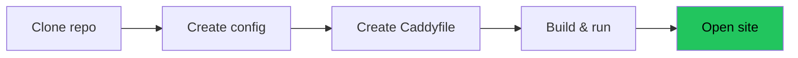
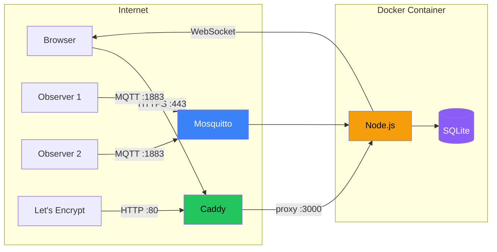
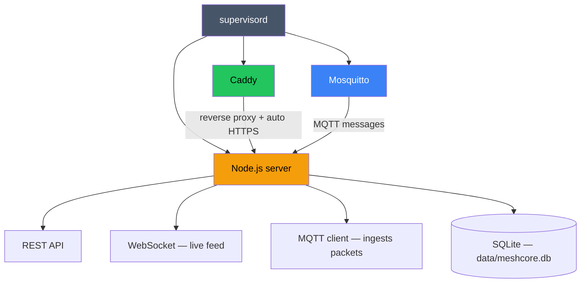
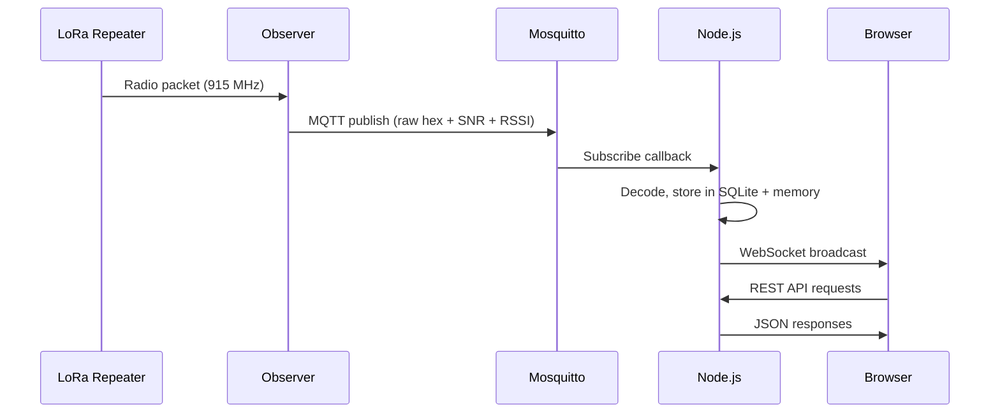

# Deploying CoreScope

Get CoreScope running with automatic HTTPS on your own server.

## Table of Contents

- [What You'll End Up With](#what-youll-end-up-with)
- [What You Need Before Starting](#what-you-need-before-starting)
- [Installing Docker](#installing-docker)
- [Quick Start](#quick-start)
- [Connecting an Observer](#connecting-an-observer)
- [HTTPS Options](#https-options)
- [MQTT Security](#mqtt-security)
- [Database Backups](#database-backups)
- [Updating](#updating)
- [Customization](#customization)
- [Troubleshooting](#troubleshooting)
- [Architecture Overview](#architecture-overview)

## What You'll End Up With

- CoreScope running at `https://your-domain.com`
- Automatic HTTPS certificates (via Let's Encrypt + Caddy)
- Built-in MQTT broker for receiving packets from observers
- SQLite database for packet storage (auto-created)
- Everything in a single Docker container

## What You Need Before Starting

### A server
A computer that's always on and connected to the internet:
- **Cloud VM** — DigitalOcean, Linode, Vultr, AWS, Azure, etc. A $5-6/month VPS works. Pick **Ubuntu 22.04 or 24.04**.
- **Raspberry Pi** — Works, just slower to build.
- **Home PC/laptop** — Works if your ISP doesn't block ports 80/443 (many residential ISPs do).

You'll need **SSH access** to your server. Cloud providers give you instructions when you create the VM.

### A domain name
A domain (like `analyzer.example.com`) pointed at your server's IP:
- Buy one (~$10/year) from Namecheap, Cloudflare, etc.
- Or use a free subdomain from [DuckDNS](https://www.duckdns.org/) or [FreeDNS](https://freedns.afraid.org/)

After getting a domain, create an **A record** pointing to your server's IP address. Your domain provider's dashboard will have a "DNS" section for this.

**Important:** DNS must be configured and propagated *before* you start the container. Caddy will try to provision certificates on startup and fail if the domain doesn't resolve. Verify with `dig analyzer.example.com` — it should show your server's IP.

### Open ports
Your server's firewall must allow:
- **Port 80** — needed for HTTPS certificate provisioning (Let's Encrypt ACME challenge)
- **Port 443** — HTTPS traffic

Cloud providers: find "Security Groups" or "Firewall" in the dashboard, add inbound rules for TCP 80 and 443 from 0.0.0.0/0.

Ubuntu firewall:
```bash
sudo ufw allow 80/tcp
sudo ufw allow 443/tcp
```

## Installing Docker

Docker packages an app and all its dependencies into a container — an isolated environment with everything it needs to run. You don't install Node.js, Mosquitto, or Caddy separately; they're all included in the container.

SSH into your server and run:

```bash
# Install Docker
curl -fsSL https://get.docker.com | sh

# Allow your user to run Docker without sudo
sudo usermod -aG docker $USER
```

**Log out and SSH back in** (the group change needs a new session), then verify:

```bash
docker --version
# Should print: Docker version 24.x.x or newer
```

## Quick Start

The easiest way — use the management script:

```bash
git clone https://github.com/Kpa-clawbot/corescope.git
cd corescope
./manage.sh setup
```

It walks you through everything: checks Docker, creates config, asks for your domain, checks DNS, builds, and starts.

After setup, manage with:
```bash
./manage.sh status       # Check if everything's running
./manage.sh logs         # View logs
./manage.sh backup       # Backup the database
./manage.sh update       # Pull latest + rebuild + restart
./manage.sh mqtt-test    # Check if MQTT data is flowing
./manage.sh help         # All commands
```

### Manual setup



### 1. Download the code

```bash
git clone https://github.com/Kpa-clawbot/corescope.git
cd corescope
```

### 2. Create your config

```bash
cp config.example.json config.json
nano config.json
```

Change the `apiKey` to any random string. The rest of the defaults work out of the box.

```jsonc
{
  "apiKey": "change-me-to-something-random",
  ...
}
```

Save: `Ctrl+O`, `Enter`, `Ctrl+X`.

### 3. Set up your domain for HTTPS

```bash
mkdir -p caddy-config
nano caddy-config/Caddyfile
```

Enter your domain (replace `analyzer.example.com` with yours):

```
analyzer.example.com {
    reverse_proxy localhost:3000
}
```

Save and close. Caddy handles certificates, renewals, and HTTP→HTTPS redirects automatically.

### 4. Build and run

```bash
docker build -t corescope .

docker run -d \
  --name corescope \
  --restart unless-stopped \
  -p 80:80 \
  -p 443:443 \
  -v $(pwd)/config.json:/app/config.json:ro \
  -v $(pwd)/caddy-config/Caddyfile:/etc/caddy/Caddyfile:ro \
  -v meshcore-data:/app/data \
  -v caddy-data:/data/caddy \
  corescope
```

What each flag does:
| Flag | Purpose |
|------|---------|
| `-d` | Run in background |
| `--restart unless-stopped` | Auto-restart on crash or reboot |
| `-p 80:80 -p 443:443` | Expose web ports |
| `-v .../config.json:...ro` | Your config (read-only) |
| `-v .../Caddyfile:...` | Your domain config |
| `-v meshcore-data:/app/data` | Database storage (persists across restarts) |
| `-v caddy-data:/data/caddy` | HTTPS certificate storage |

### 5. Verify

Open `https://your-domain.com`. You should see the analyzer home page.

Check the logs:
```bash
docker logs corescope
```

Expected output:
```
CoreScope running on http://localhost:3000
MQTT [local] connected to mqtt://localhost:1883
[pre-warm] 12 endpoints in XXXms
```

The container runs its own MQTT broker (Mosquitto) internally — that `localhost:1883` connection is inside the container, not exposed to the internet.

## Connecting an Observer

The analyzer receives packets from observers via MQTT.

### Option A: Use a public broker

Add a remote broker to `mqttSources` in your `config.json`:

```json
{
  "name": "public-broker",
  "broker": "mqtts://mqtt.lincomatic.com:8883",
  "username": "your-username",
  "password": "your-password",
  "rejectUnauthorized": false,
  "topics": ["meshcore/SJC/#", "meshcore/SFO/#"]
}
```

Restart: `docker restart corescope`

### Option B: Run your own observer

You need a MeshCore repeater connected via USB or BLE to a computer running [meshcoretomqtt](https://github.com/Cisien/meshcoretomqtt). Point it at your analyzer's MQTT broker.

⚠️ If your observer is remote (not on the same machine), you'll need to expose port 1883. **Read the MQTT Security section first.**

## HTTPS Options

### Automatic (recommended) — Caddy + Let's Encrypt

This is what the Quick Start sets up. Caddy handles everything. Requirements:
- Domain pointed at your server
- Ports 80 + 443 open
- No other web server (Apache, nginx) running on those ports

### Bring your own certificate

If you already have a certificate (from Cloudflare, your organization, etc.), tell Caddy to use it instead of Let's Encrypt:

```
analyzer.example.com {
    tls /path/to/cert.pem /path/to/key.pem
    reverse_proxy localhost:3000
}
```

Mount the cert files into the container:
```bash
docker run ... \
  -v /path/to/cert.pem:/certs/cert.pem:ro \
  -v /path/to/key.pem:/certs/key.pem:ro \
  ...
```

And update the Caddyfile paths to `/certs/cert.pem` and `/certs/key.pem`.

### Cloudflare Tunnel (no open ports needed)

If you can't open ports 80/443 (residential ISP, restrictive firewall), use a [Cloudflare Tunnel](https://developers.cloudflare.com/cloudflare-one/connections/connect-networks/). It creates an outbound connection from your server to Cloudflare — no inbound ports needed. Your Caddyfile becomes:

```
:80 {
    reverse_proxy localhost:3000
}
```

And Cloudflare handles HTTPS at the edge.

### Behind an existing reverse proxy (nginx, Traefik, etc.)

If you already run a reverse proxy, skip Caddy entirely and proxy directly to the Node.js port:

```bash
docker run -d \
  --name corescope \
  --restart unless-stopped \
  -p 3000:3000 \
  -v $(pwd)/config.json:/app/config.json:ro \
  -v meshcore-data:/app/data \
  corescope
```

Then configure your existing proxy to forward traffic to `localhost:3000`.

### HTTP only (development / local network)

For local testing or a LAN-only setup, use the default Caddyfile that ships in the image (serves on port 80, no HTTPS):

```bash
docker run -d \
  --name corescope \
  --restart unless-stopped \
  -p 80:80 \
  -v $(pwd)/config.json:/app/config.json:ro \
  -v meshcore-data:/app/data \
  corescope
```

## MQTT Security

The container runs Mosquitto on port 1883 with **anonymous access by default**. This is safe as long as the port isn't exposed outside the container.

The Quick Start docker run command above does **not** expose port 1883. Only add `-p 1883:1883` if you need remote observers to connect directly.

### If you need to expose MQTT

**Option 1: Firewall** — Only allow specific IPs:
```bash
sudo ufw allow from 203.0.113.10 to any port 1883   # Your observer's IP
```

**Option 2: Add authentication** — Edit `docker/mosquitto.conf` before building:
```
allow_anonymous false
password_file /etc/mosquitto/passwd
```
After starting the container, create users:
```bash
docker exec -it corescope mosquitto_passwd -c /etc/mosquitto/passwd myuser
```

**Option 3: Use TLS** — For production, configure Mosquitto with TLS certificates. See the [Mosquitto docs](https://mosquitto.org/man/mosquitto-conf-5.html).

### Recommended approach for remote observers

Don't expose 1883 at all. Instead, have your observers publish to a shared public MQTT broker (like lincomatic's), and configure your analyzer to subscribe to that broker in `mqttSources`. The analyzer makes an outbound connection — no inbound ports needed.

## Database Backups

Packet data is stored in `meshcore.db` inside the data volume.

**Using manage.sh (easiest):**

```bash
./manage.sh backup                          # Saves to ./backups/corescope-TIMESTAMP/
./manage.sh backup ~/my-backup.db           # Custom path
./manage.sh restore ./backups/some-file.db  # Restore (backs up current DB first)
```

**Local directory mount (recommended):**

If you used `-v ./analyzer-data:/app/data` instead of a Docker volume, the database is just `./analyzer-data/meshcore.db` — back it up however you like.

**Automated daily backup (cron):**

```bash
crontab -e
# Add:
0 3 * * * cd /path/to/corescope && ./manage.sh backup
```

## Updating

```bash
./manage.sh update
```

Pulls latest code, rebuilds the image, restarts the container. Data is preserved.

Data is preserved in the Docker volumes.

**Tip:** Save your `docker run` command in a script (`run.sh`) so you don't have to remember all the flags.

## Customization

### Branding

In `config.json`:

```json
{
  "branding": {
    "siteName": "Bay Area Mesh",
    "tagline": "Community LoRa network for the Bay Area",
    "logoUrl": "https://example.com/logo.png",
    "faviconUrl": "https://example.com/favicon.ico"
  }
}
```

### Themes

Create a `theme.json` in your data directory to customize colors. See [CUSTOMIZATION.md](./CUSTOMIZATION.md) for all options.

### Map defaults

Center the map on your area in `config.json`:

```json
{
  "mapDefaults": {
    "center": [37.45, -122.0],
    "zoom": 9
  }
}
```

## Troubleshooting

| Problem | Likely cause | Fix |
|---------|-------------|-----|
| Site shows "connection refused" | Container not running | `docker ps` to check, `docker logs corescope` for errors |
| HTTPS not working | Port 80 blocked | Open port 80 — Caddy needs it for ACME challenges |
| "too many certificates" error | Let's Encrypt rate limit (5/domain/week) | Use a different subdomain, bring your own cert, or wait a week |
| Certificate won't provision | DNS not pointed at server | `dig your-domain` must show your server IP before starting |
| No packets appearing | No observer connected | `docker exec corescope mosquitto_sub -t 'meshcore/#' -C 1 -W 10` — if silent, no data is coming in |
| Container crashes on startup | Bad JSON in config | `python3 -c "import json; json.load(open('config.json'))"` to validate |
| "address already in use" | Another web server on 80/443 | Stop it: `sudo systemctl stop nginx apache2` |
| Slow on Raspberry Pi | First build is slow | Normal — subsequent builds use cache. Runtime performance is fine. |

## Architecture Overview

### Traffic flow



### Container internals



### Data flow


