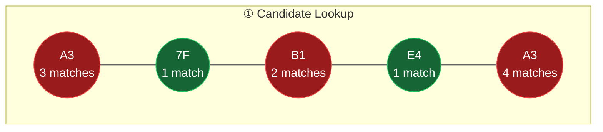
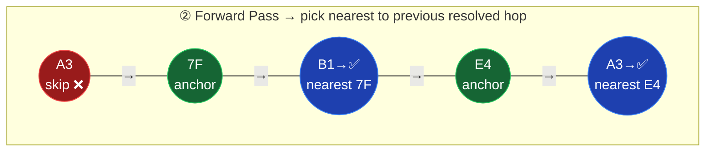
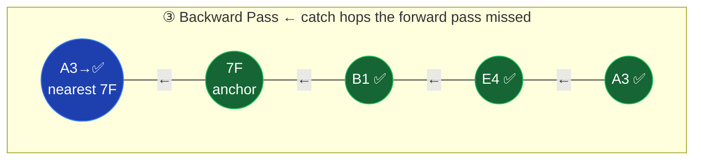

# Hash Prefix Disambiguation in CoreScope

## Section 1: Executive Summary

### What Are Hash Prefixes?

MeshCore is a LoRa mesh network where every packet records the nodes it passed through (its "path"). To save bandwidth on a constrained radio link, each hop in the path is stored as a **truncated hash** of the node's public key — typically just **1 byte** (2 hex characters), though the firmware supports 1–3 bytes per hop.

With 1-byte hashes, there are only 256 possible values. In any mesh with more than ~20 nodes, **collisions are inevitable** — multiple nodes share the same prefix.

### How Disambiguation Works

When displaying a packet's path (e.g., `A3 → 7F → B1`), the system must figure out *which* node each prefix refers to. The algorithm is the same everywhere:

1. **Prefix lookup** — Find all known nodes whose public key starts with the hop's hex prefix
2. **Trivial case** — If exactly one match, use it
3. **Regional filtering** (server `/api/resolve-hops` only) — If the packet came from a known geographic region (via observer IATA code), filter candidates to nodes near that region
4. **Forward pass** — Walk the path left-to-right; for each ambiguous hop, pick the candidate closest to the previous resolved hop
5. **Backward pass** — Walk right-to-left for any still-unresolved hops, using the next hop as anchor
6. **Sanity check** — Flag hops that are geographically implausible (>~200 km from both neighbors) as `unreliable`

### When It Matters

- **Packet path display** (packets page, node detail, live feed) — every path shown to users goes through disambiguation
- **Topology analysis** (analytics subpaths) — route patterns rely on correctly identifying repeaters
- **Map route overlay** — drawing lines between hops on a map requires resolved coordinates
- **Auto-learning** — the server creates stub node records for unknown 2+ byte hop prefixes

### Known Limitations

- **1-byte prefixes are inherently lossy** — 256 possible values for potentially thousands of nodes. Regional filtering helps but can't solve all collisions.
- **Nodes without GPS** — If no candidates have coordinates, geographic disambiguation can't help; the first candidate wins arbitrarily.
- **Regional filtering is server-only** — The `/api/resolve-hops` endpoint has observer-based fallback filtering (for GPS-less nodes seen by regional observers). The client-side `HopResolver` only does geographic regional filtering.
- **Stale prefix index** — The server caches the prefix index on the `allNodes` array object. It's cleared on node upsert but could theoretically serve stale data briefly.

### How the Two-Pass Algorithm Works

A packet path arrives as truncated hex prefixes. Some resolve to one node (unique), some match multiple (ambiguous). Two passes guarantee every hop gets resolved:







**Forward** resolves hops that have a known node to their left. **Backward** catches the ones at the start of the path that had no left anchor. After both passes, every hop either resolved to a specific node or has no candidates at all.

---

## Section 2: Technical Details

### 2.1 Firmware: How Hops Are Encoded

From `firmware/src/MeshCore.h`:
```c
#define PATH_HASH_SIZE  1    // Default: 1 byte per hop
#define MAX_HASH_SIZE   8    // Maximum hash size for dedup tables
```

The **path_length byte** in each packet encodes both hop count and hash size:
- **Bits 0–5**: hop count (0–63)
- **Bits 6–7**: hash size minus 1 (`0b00` = 1 byte, `0b01` = 2 bytes, `0b10` = 3 bytes)

From `firmware/docs/packet_format.md`: the path section is `hop_count × hash_size` bytes, with a maximum of 64 bytes (`MAX_PATH_SIZE`). Each hop hash is the first N bytes of the node's public key hash.

The `sendFlood()` function accepts `path_hash_size` parameter (default 1), allowing nodes to use larger hashes when configured.

### 2.2 Decoder: Extracting Hops

`decoder.js` — `decodePath(pathByte, buf, offset)`:
```javascript
const hashSize = (pathByte >> 6) + 1;   // 1-4 bytes per hash
const hashCount = pathByte & 0x3F;       // 0-63 hops
```
Each hop is extracted as `hashSize` bytes of hex. The decoder is straightforward and doesn't do any disambiguation — it outputs raw hex prefixes.

### 2.3 Server-Side Disambiguation

There are **three** disambiguation implementations on the server:

#### 2.3.1 `disambiguateHops()` — in both `server.js` (line 498) and `server-helpers.js` (line 149)

The primary workhorse. Used by most API endpoints. Algorithm:

1. **Build prefix index** (cached on the `allNodes` array):
   - For each node, index its public key at 1-byte (2 hex), 2-byte (4 hex), and 3-byte (6 hex) prefix lengths
   - `_prefixIdx[prefix]` → array of matching nodes
   - `_prefixIdxName[prefix]` → first matching node (name fallback)

2. **First pass — candidate matching**:
   - Look up `prefixIdx[hop]`; filter to nodes with valid coordinates
   - 1 match with coords → resolved
   - Multiple matches with coords → ambiguous (keep candidate list)
   - 0 matches with coords → fall back to `prefixIdxName` for name only

3. **Forward pass**: Walk left→right, sort ambiguous candidates by distance to last known position, pick closest.

4. **Backward pass**: Walk right→left, same logic with next known position.

5. **Sanity check**: Mark hops as `unreliable` if they're >MAX_HOP_DIST (default 1.8° ≈ 200 km) from both neighbors. Clear their lat/lon.

**Callsites** (all in `server.js`):
| Line | Context |
|------|---------|
| 2480 | `/api/paths` — group and resolve path display |
| 2659 | `/api/analytics/topology` — topology graph |
| 2720 | `/api/analytics/subpaths` — route pattern analysis |
| 2788 | `/api/node/:key` — node detail page, packet paths |
| 2822 | `/api/node/:key` — parent path resolution |

#### 2.3.2 `/api/resolve-hops` endpoint (server.js line 1944)

The most sophisticated version — used by the client-side packets page as fallback (though `HopResolver` handles most cases now). Additional features beyond `disambiguateHops()`:

- **Regional filtering**: Uses observer IATA codes to determine packet region
  - **Layer 1 (Geographic)**: If candidate has GPS, check distance to IATA region center (≤300 km)
  - **Layer 2 (Observer-based)**: If candidate has no GPS, check if its adverts were seen by regional observers
- **Origin/observer anchoring**: Accepts `originLat/originLon` (sender position) as forward anchor and derives observer position as backward anchor
- **Linear scan for candidates**: Uses `allNodes.filter(startsWith)` instead of prefix index (slower but always fresh)

#### 2.3.3 Inline `resolveHop()` in analytics endpoints

Two analytics endpoints (`/api/analytics/topology` line 1432 and `/api/analytics/hash-issues` line 1699) define local `resolveHop()` closures that do simple prefix matching without the full forward/backward pass — they resolve hops individually without path context.

### 2.4 `autoLearnHopNodes()` (server.js line 569)

When packets arrive, this function checks each hop:
- Skips 1-byte hops (too ambiguous to learn from)
- For 2+ byte hops not already in the DB, creates a stub node record with `role: 'repeater'`
- Uses an in-memory `hopNodeCache` Set to avoid redundant DB queries

Called during:
- MQTT packet ingestion (line 686)
- HTTP packet submission (line 1019)

### 2.5 Client-Side: `HopResolver` (public/hop-resolver.js)

A client-side IIFE (`window.HopResolver`) that mirrors the server's algorithm to avoid HTTP round-trips. Key differences from server:

| Aspect | Server `disambiguateHops()` | Server `/api/resolve-hops` | Client `HopResolver` |
|--------|---------------------------|---------------------------|---------------------|
| Prefix index | Cached on allNodes array | Linear filter | Built in `init()` |
| Regional filtering | None | IATA geo + observer-based | IATA geo only |
| Origin anchor | None | Yes (from query params) | Yes (from params) |
| Observer anchor | None | Yes (derived from DB) | Yes (from params) |
| Sanity check | unreliable + clear coords | unreliable only | unreliable flag |
| Distance function | `geoDist()` (Euclidean) | `dist()` (Euclidean) | `dist()` (Euclidean) |

**Initialization**: `HopResolver.init(nodes, { observers, iataCoords })` — builds prefix index for 1–3 byte prefixes.

**Resolution**: `HopResolver.resolve(hops, originLat, originLon, observerLat, observerLon, observerId)` — runs the same 3-phase algorithm (candidates → forward → backward → sanity check).

### 2.6 Client-Side: `resolveHopPositions()` in live.js (line 1562)

The live feed page has its **own independent implementation** that doesn't use `HopResolver`. It:
- Filters from `nodeData` (live feed's own node cache)
- Uses the same forward/backward/sanity algorithm
- Also prepends the sender as position anchor
- Includes "ghost hop" rendering for unresolved hops

### 2.7 Where Disambiguation Is Applied (All Callsites)

**Server-side:**
| File | Function/Line | What |
|------|--------------|------|
| server.js:498 | `disambiguateHops()` | Core algorithm |
| server.js:569 | `autoLearnHopNodes()` | Stub node creation for 2+ byte hops |
| server.js:1432 | inline `resolveHop()` | Analytics topology tab |
| server.js:1699 | inline `resolveHop()` | Analytics hash-issues tab |
| server.js:1944 | `/api/resolve-hops` | Full resolution with regional filtering |
| server.js:2480 | paths endpoint | Path grouping |
| server.js:2659 | topology endpoint | Topology graph |
| server.js:2720 | subpaths endpoint | Route patterns |
| server.js:2788 | node detail | Packet paths for a node |
| server.js:2822 | node detail | Parent paths |
| server-helpers.js:149 | `disambiguateHops()` | Extracted copy (used by tests) |

**Client-side:**
| File | Function | What |
|------|---------|------|
| hop-resolver.js | `HopResolver.resolve()` | Main client resolver |
| packets.js:121+ | `resolveHops()` wrapper | Packets page path display |
| packets.js:1388 | Direct `HopResolver.resolve()` | Packet detail pane with sender context |
| live.js:1562 | `resolveHopPositions()` | Live feed path lines (independent impl) |
| map.js:273+ | Route overlay | Map path drawing (uses server-resolved data) |
| analytics.js | subpaths display | Renders server-resolved names |

### 2.8 Consistency Analysis

**Core algorithm**: All implementations use the same 3-phase approach (candidate lookup → forward pass → backward pass → sanity check). The logic is consistent.

**Discrepancies found:**

1. **`server.js disambiguateHops()` vs `server-helpers.js disambiguateHops()`**: These are near-identical copies. The server-helpers version is extracted for testing. Both use `geoDist()` (Euclidean approximation). No functional discrepancy.

2. **`/api/resolve-hops` vs `disambiguateHops()`**: The API endpoint is significantly more capable — it has regional filtering (IATA geo + observer-based) and origin/observer anchoring. Endpoints that use `disambiguateHops()` directly (paths, topology, subpaths, node detail) **do not benefit from regional filtering**, which may produce different results for the same hops.

3. **`live.js resolveHopPositions()` vs `HopResolver`**: The live feed reimplements disambiguation independently. It lacks:
   - Regional/IATA filtering
   - Origin/observer GPS anchoring (it does use sender position as anchor, but differently)
   - The prefix index optimization (uses linear `Array.filter()`)

4. **Inline `resolveHop()` in analytics**: These resolve hops individually without path context (no forward/backward pass). A hop ambiguous between two nodes will always get the first match rather than the geographically consistent one.

5. **`disambiguateHops()` only considers nodes with coordinates** for the candidate list. Nodes without GPS are filtered out in the first pass. The `/api/resolve-hops` endpoint also returns no-GPS nodes in its candidate list and uses observer-based region filtering as fallback.

### 2.9 Edge Cases

| Edge Case | Behavior |
|-----------|----------|
| **No candidates** | Hop displayed as raw hex prefix |
| **All candidates lack GPS** | `disambiguateHops()`: name from `prefixIdxName` (first indexed), no position. `HopResolver`: first candidate wins |
| **Ambiguous after both passes** | First candidate in list wins (effectively random without position data) |
| **Mixed hash sizes in same path** | Each hop is whatever length the decoder extracted. Prefix index handles variable lengths (indexed at 1, 2, 3 byte prefixes) |
| **Self-loops in subpaths** | Same prefix appearing twice likely means a collision, not an actual loop. Analytics UI flags these with 🔄 and offers "hide collisions" checkbox |
| **Unknown observers** | Regional filtering falls back to no filtering; all candidates considered |
| **0,0 coordinates** | Explicitly excluded everywhere (`!(lat === 0 && lon === 0)`) |

### 2.10 Visual Decollision on the Map (Different System)

The **map label deconfliction** in `map.js` (`deconflictLabels()`, line 367+) is a completely different system. It handles **visual overlap** of hop labels on the Leaflet map — when two resolved hops are at nearby coordinates, their text labels would overlap. The function offsets labels to prevent visual collision using bounding-box checks.

This is **not related** to hash prefix disambiguation — it operates on already-resolved, positioned hops and only affects label rendering, not which node a prefix maps to.

Similarly, the map's "cluster" mode (`L.markerClusterGroup`) groups nearby node markers visually and is unrelated to hash disambiguation.

### 2.11 Data Flow Diagram

```
                    FIRMWARE (LoRa)
                         │
              Packet with 1-3 byte hop hashes
                         │
                         ▼
                ┌─────────────────┐
                │  MQTT Broker(s) │
                └────────┬────────┘
                         │
                         ▼
              ┌──────────────────────┐
              │     server.js        │
              │  ┌────────────────┐  │
              │  │   decoder.js   │  │  Extract raw hop hex prefixes
              │  └───────┬────────┘  │
              │          │           │
              │          ▼           │
              │  autoLearnHopNodes() │  Create stub nodes for 2+ byte hops
              │          │           │
              │  packet-store.js     │  Store packet with raw hops
              └──────────┬──────────┘
                         │
            ┌────────────┼────────────┐
            │            │            │
            ▼            ▼            ▼
    REST API calls   WebSocket    /api/resolve-hops
            │        broadcast          │
            │            │              │
            ▼            │              ▼
   disambiguateHops()    │     Regional filtering +
   (no regional filter)  │     geo disambiguation
            │            │              │
            ▼            ▼              ▼
        ┌────────────────────────────────────┐
        │           BROWSER                   │
        │                                     │
        │  packets.js ──► HopResolver.resolve()
        │    (geo + IATA regional filtering)  │
        │                                     │
        │  live.js ──► resolveHopPositions()  │
        │    (geo only, independent impl)     │
        │                                     │
        │  map.js ──► deconflictLabels()      │
        │    (visual label offsets only)       │
        │                                     │
        │  analytics.js ──► server-resolved   │
        └─────────────────────────────────────┘
```

### 2.12 Hash Size Detection

Separate from disambiguation but closely related: the system tracks which hash size each node uses. `server-helpers.js` has `updateHashSizeForPacket()` and `rebuildHashSizeMap()` which extract the hash_size from the path_length byte. This feeds the analytics "hash issues" tab which detects nodes that flip-flop between hash sizes (a firmware behavior that complicates analysis).
